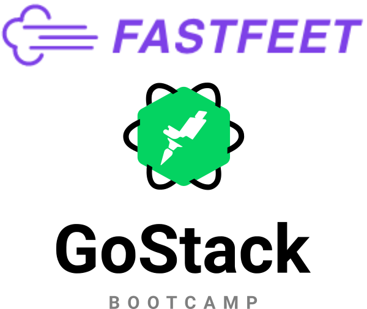

<h1 align="center">
  
</h1>

Este codigo representa a minha solução do desafio do Bootcamp GoStack 10.0

 <a href="#rocket-tecnologias">Tecnologias</a>&nbsp;&nbsp;&nbsp;|&nbsp;&nbsp;&nbsp;
 <a href="#computer-instalação-execução-e-desenvolvimento">Instalação, execução e desenvolvimento</a>

<strong>Links dos desafios:</strong>

- [Etapa 1](https://github.com/vsSanti/FastFeet/blob/master/etapas/ETAPA_01.md)
- [Etapa 2](https://github.com/vsSanti/FastFeet/blob/master/etapas/ETAPA_02.md)
- [Etapa 3](https://github.com/vsSanti/FastFeet/blob/master/etapas/ETAPA_03.md)
- [Etapa 4](https://github.com/vsSanti/FastFeet/blob/master/etapas/ETAPA_04.md)

## :rocket: Tecnologias

Esse projeto foi desenvolvido com as seguintes tecnologias:

- [Node.js](https://nodejs.org/en/)
- [React](https://reactjs.org/)
- [PostgreSQL](https://www.postgresql.org/)
- [MongoDB](https://www.mongodb.com/)
- [Express](https://github.com/expressjs/express)
- [Redis](https://redis.io/)
- [Bee-Queue](https://github.com/bee-queue/bee-queue)

## :computer: Instalação, execução e desenvolvimento

### Pré-requisitos

- [Node.js](https://nodejs.org/en/)
- [PostgreSQL](https://www.postgresql.org/)
- [Redis](https://redis.io/)
- [Clonar o projeto](https://github.com/vsSanti/FastFeet)

**Faça um clone desse repositório**

### Backend

- A partir da raiz do projeto, entre na pasta rodando `cd server`;
- Rode `yarn` para instalar sua dependências;
- Rode `cp .env.example .env` e preencha o arquivo `.env` com SUAS variáveis ambiente;
- Rode `yarn sequelize db:migrate` para executar as migrations;
- Rode `yarn sequelize db:seed:all` para criar um `admin-user`;
- Rode `yarn dev` para iniciar o a API;
- Rode `yarn queue` para iniciar a fila de e-mails.

**Obs.**
- Faça download do arquivo `Insomnia.json` e o abra no programa Insomnia para saber mais sobre as requisições.

### Web

_ps: Antes de executar, lembre-se de iniciar o backend deste projeto_

- A partir da raiz do projeto, entre na pasta do frontend web rodando `cd web`;
- Rode `yarn` para instalar as dependências;
- Rode `yarn start` para iniciar o client web.

### Mobile

_ps: Antes de executar, lembre-se de iniciar o backend deste projeto_

- A partir da raiz do projeto, entre na pasta do frontend mobile rodando `cd mobile`;
- Rode `yarn` para instalar as dependências;
- Edite o arquivo `mobile/src/services/api.js`, alterando `baseURL` para o IP e porta correspondente a máquina que estiver executando o `backend`;
- Para rodar o projeto, siga os passos da [documentação da Rocketseat](https://react-native.rocketseat.dev/).

**Obs.**
- O projeto mobile foi desenvolvido e testado somente para a **plataforma iOS**.

---

Feito com 💜 by [Vinícius Santiago](https://www.linkedin.com/in/viniciussdsilva/)

---

Introdução fortemente inspirada no README.md do [EliasGcf](https://www.linkedin.com/in/eliasgcf/)
